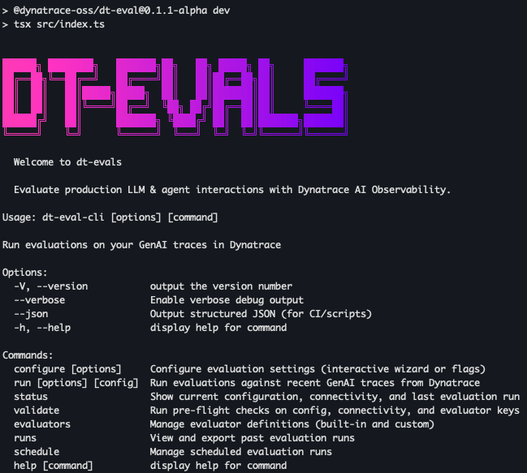

# dt-evals

End-to-end LLM evaluation toolkit for Dynatrace AI Observability.

`dt-eval` is the main interface. It pulls live `gen_ai.*` spans from your Dynatrace environment, masks sensitive data in memory, scores real production interactions with an LLM judge, and writes structured evaluation results back to Dynatrace as business events — keeping evals, traces, metrics, alerts, and dashboards in one place.



## Packages

| Package | Description |
|---------|-------------|
| [`dt-eval`](dt-eval-cli) | CLI — configure, run, schedule, inspect, and deploy evals |
| [`dt-eval-lib`](dt-eval-lib) | TypeScript library — run judge-based evals in code, tests, and CI |
| [`dt-eval-deploy`](dt-eval-deploy) | Deployment resources — Docker image and serverless runners |

## Requirements

- Node.js `>=20`
- A Dynatrace environment with GenAI spans (`gen_ai.*` OTEL attributes)
- Credentials for your judge provider (OpenAI, Anthropic, Google, AWS Bedrock, or Azure OpenAI)

## Install

```bash
npm install -g github:dynatrace-oss/dt-evals
```

Or run without installing:

```bash
npx github:dynatrace-oss/dt-evals <command>
```

## Quick Start

```bash
# 1. Configure credentials and provider interactively
dt-eval configure

# 2. Validate connectivity end-to-end
dt-eval validate

# 3. Run evals on the last hour of traces
dt-eval run --since 1h --sample 10
```

---

## CLI Reference

### `configure`

Set up Dynatrace and judge provider credentials. Writes to `.dt-eval.yaml` in the current directory or `~/.dt-eval/config.yaml` globally.

```bash
# Interactive wizard
dt-eval configure

# Non-interactive
dt-eval configure \
  --env-url https://your-env.live.dynatrace.com \
  --api-token "$DT_API_TOKEN" \
  --provider openai \
  --api-key "$OPENAI_API_KEY" \
  --model gpt-4.1

# Show resolved config with secrets redacted
dt-eval configure --show
```

---

### `validate`

Check config schema, Dynatrace connectivity, and judge provider reachability before running.

```bash
dt-eval validate
```

---

### `run`

Evaluate recent GenAI traces from Dynatrace.

```bash
# Run all enabled evaluators over the last 2 hours, 20% sample
dt-eval run --since 2h --sample 20

# Run a single evaluator
dt-eval run --since 6h --metric faithfulness

# Preview what would run — no judge calls, no result writes
dt-eval run --since 1h --sample 5 --dry-run

# CI mode — JSON output, exit 1 on threshold breach
dt-eval run --since 6h --metric relevance --ci

# Parallel workers for faster throughput
dt-eval run --since 2h --sample 20 --concurrency 8 --debug
```

**Flags:**

| Flag | Description |
|------|-------------|
| `--since <duration>` | Trace lookback window, e.g. `1h`, `6h`, `24h` |
| `--sample <percent>` | Override sampling: percentage of traces to evaluate (0–100). When omitted, uses the strategy from your config file (default: random 5%) |
| `--metric <name>` | Run only one evaluator |
| `--dry-run` | Fetch and transform traces, skip judge calls and writes |
| `--ci` | JSON result output and exit code `1` on threshold breach |
| `--concurrency <n>` | Number of parallel evaluation workers |
| `--debug` | Per-step timing logs |
| `--config <path>` | Path to a specific config file |

**GitHub Actions example:**

```yaml
- name: Run LLM eval gate
  run: npx dt-eval run --since 6h --metric faithfulness --ci
  env:
    DT_ENV_URL: ${{ secrets.DT_ENV_URL }}
    DT_API_TOKEN: ${{ secrets.DT_API_TOKEN }}
    OPENAI_API_KEY: ${{ secrets.OPENAI_API_KEY }}
```

---

### `evaluators`

Inspect, test, and manage built-in and custom evaluators.

```bash
# List all available evaluators
dt-eval evaluators list

# Show details for one evaluator (prompt, required fields, scoring scale)
dt-eval evaluators show faithfulness

# Send a test trace through the judge for an evaluator
dt-eval evaluators test relevance

# Add a custom evaluator interactively
dt-eval evaluators add

# Remove a custom evaluator
dt-eval evaluators delete my-custom-eval
```

---

### `runs`

View and export local run history from `~/.dt-eval/runs.json`.

```bash
# List recent runs
dt-eval runs list --limit 20

# Inspect a single run in detail
dt-eval runs show run-2026-04-10T12-00-00-ab12cd34

# Export run history
dt-eval runs export --format csv --output runs.csv
dt-eval runs export --format json --output runs.json
```

---

### `schedule`

Configure recurring evaluation runs stored in `~/.dt-eval/schedules.json`.

```bash
# Create a schedule
dt-eval schedule add --name hourly-rag --cron "0 * * * *" --since 1h --sample 10

# List schedules
dt-eval schedule list

# Trigger a schedule immediately
dt-eval schedule run <schedule-id>

# Pause or resume
dt-eval schedule disable <schedule-id>
dt-eval schedule enable <schedule-id>

# Remove
dt-eval schedule delete <schedule-id>
```

---

### `status`

Show resolved config, connectivity state, and last run summary.

```bash
dt-eval status
```

---

### `deploy`

Package and deploy the eval runner as a serverless function for continuous scheduled evaluation.

```bash
dt-eval deploy --provider aws      # AWS Lambda
dt-eval deploy --provider gcp      # Google Cloud Run
dt-eval deploy --provider azure    # Azure Functions
dt-eval deploy --teardown          # Destroy deployed resources
```

See [`dt-eval-deploy`](dt-eval-deploy) for Docker-based deployment.

---

## Built-in Evaluators

13 built-in LLM judge evaluators plus statistical drift detection.

| Evaluator | Measures |
|-----------|----------|
| `toxicity` | Harmful, offensive, or unsafe output |
| `faithfulness` | Answer grounded in provided context |
| `hallucination` | Unsupported or fabricated claims |
| `relevance` | Answer addresses the user request |
| `coherence` | Structure, clarity, and logical flow |
| `factual-accuracy` | Accuracy against a reference answer |
| `answer-completeness` | All parts of the request answered |
| `context-relevance` | Retrieval quality for supplied context |
| `pii-leakage` | PII present in the output |
| `prompt-injection` | Injection attempts in the input |
| `bias` | Harmful bias or unfair framing |
| `summarization-quality` | Summary faithfulness, coverage, conciseness |
| `conciseness` | Avoids filler and unnecessary padding |
| `drift` | Score regression against a 7 day baseline |

---

## Supported Providers

| Provider | Default model | Notes |
|----------|--------------|-------|
| `openai` | `gpt-5.4` | `OPENAI_API_KEY` |
| `anthropic` | `claude-sonnet-4-7` | `ANTHROPIC_API_KEY` |
| `vertex` | `gemini-3-pro` | `GOOGLE_API_KEY` |
| `gemini` | `gemini-3.1-flash-live` | `GOOGLE_API_KEY` |
| `bedrock` | `anthropic.claude-opus-4-7` | `AWS_ACCESS_KEY_ID` + `AWS_SECRET_ACCESS_KEY` |
| `azure-openai` | user-provided deployment name | `AZURE_OPENAI_API_KEY` + `AZURE_OPENAI_ENDPOINT` + `AZURE_OPENAI_API_VERSION` |

Override the model with `--model <id>` or set `judge.model` in config.

---

## Configuration

Config resolves in this order: environment variables → project `.dt-eval.yaml` → global `~/.dt-eval/config.yaml` → built-in defaults.

```yaml
schemaVersion: 1
name: travel-assistant-prod

dynatrace:
  environmentUrl: https://your-env.live.dynatrace.com
  apiToken: dt0c01.xxxxx

judge:
  provider: openai
  model: gpt-4.1
  timeout: 30000
  maxRetries: 2

scope:
  service: travel-assistant
  since: 1h
  # sampling is optional — defaults to random 5% when omitted
  sampling:
    strategy: random
    percent: 10

metrics:
  enabled:
    - faithfulness
    - hallucination
    - relevance
    - drift

alerts:
  thresholds:
    faithfulness: 0.7
    relevance: 0.7
```

**Bedrock example:**

```yaml
judge:
  provider: bedrock
  model: us.anthropic.claude-3-5-haiku-20241022-v1:0
  region: us-east-1
  # or use AWS_ACCESS_KEY_ID + AWS_SECRET_ACCESS_KEY env vars
  apiKey: <AWS_ACCESS_KEY_ID>
  secretKey: <AWS_SECRET_ACCESS_KEY>
```

**Azure OpenAI example:**

```yaml
judge:
  provider: azure-openai
  model: my-gpt4-deployment
  baseUrl: https://my-resource.openai.azure.com/
  apiVersion: 2025-04-01-preview
  # or use AZURE_OPENAI_API_KEY + AZURE_OPENAI_ENDPOINT + AZURE_OPENAI_API_VERSION env vars
```

Key environment variables:

```bash
DT_ENV_URL=https://your-env.live.dynatrace.com
DT_API_TOKEN=dt0c01.xxxxx

JUDGE_PROVIDER=openai
JUDGE_MODEL=gpt-4.1

# OpenAI
OPENAI_API_KEY=sk-...
# Anthropic
ANTHROPIC_API_KEY=sk-ant-...
# Google (Vertex / Gemini)
GOOGLE_API_KEY=...
# AWS Bedrock
AWS_ACCESS_KEY_ID=...
AWS_SECRET_ACCESS_KEY=...
AWS_REGION=us-east-1
# Azure OpenAI
AZURE_OPENAI_API_KEY=...
AZURE_OPENAI_ENDPOINT=https://my-resource.openai.azure.com/
AZURE_OPENAI_API_VERSION=2025-04-01-preview
```

---

## Results in Dynatrace

Evaluation results land as business events with `event.type == "gen_ai.evaluation.result"`, correlating to the original trace.

```dql
fetch bizevents
| filter event.type == "gen_ai.evaluation.result"
| summarize avg_score = avg(gen_ai.evaluation.score.value), by: { gen_ai.evaluation.name }
| sort avg_score asc
```

---

## Development

```bash
# Install all workspace dependencies
npm install

# Test dt-eval-lib
make test-lib

# Build dt-eval-lib
make build-lib

# Build the Go engine
make build-engine

# Lint all Markdown
make markdownlint
```

Run the CLI locally without a build:

```bash
cd dt-eval-cli
npm run dev -- configure
npm run dev -- run --since 1h --dry-run
```

---

## License

Apache License 2.0 — see [LICENSE](LICENSE).
