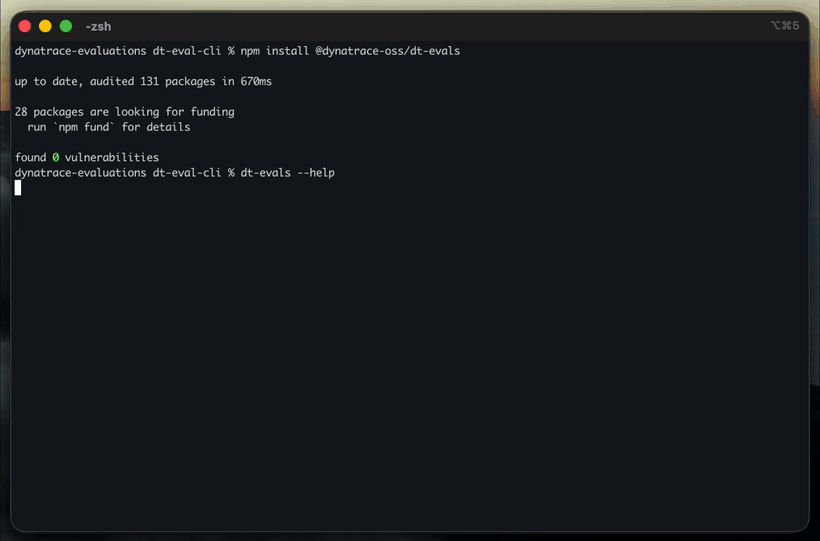

# dt-evals - Dynatrace Evaluation CLI tool

**Open source continuous evals for LLM applications, with production prompt traces as the dataset.**

[](https://www.npmjs.com/package/@dynatrace-oss/dt-evals)
[](https://www.npmjs.com/package/@dynatrace-oss/dt-evals)
[](https://github.com/dynatrace-oss/dt-evals/actions/workflows/ci-cli.yml)
[](../LICENSE)
[](package.json)



`dt-evals` is for teams shipping chat, RAG, copilots, and agent workflows who want evals to run on real traffic, not just curated test sets.

The CLI uses Dynatrace as both the trace source and the evaluation result store. It pulls `gen_ai.*` spans from your live environment, masks sensitive data in memory, scores real production interactions with an LLM judge or deterministic code checks, detects score drift over time, and writes structured results back to Dynatrace as business events. When a score drops, you can trace it back through the full AI execution path: prompts, retrieval context, model calls, tool usage, latency, and failures.

```bash
npx @dynatrace-oss/dt-evals configure
npx @dynatrace-oss/dt-evals validate
npx @dynatrace-oss/dt-evals run --since 1h --sample 10 --concurrency 10
```

> 🎮 **See it live before installing** — [**open the dt-evals playground dashboard**](https://wkf10640.apps.dynatrace.com/ui/apps/dynatrace.dashboards/dashboard/monaco-2cf9a79b-8b32-3244-aed1-e9d8c6e3e6a8) on our public Dynatrace tenant. Real evaluation runs against production GenAI traces — scores per metric, drift over time, threshold breaches, click-through to the originating trace.

## Why Teams Use It

- Run evals on real production traces, not static test sets
- Keep eval results in Dynatrace with traces, logs, metrics, dashboards, and alerts
- Catch common LLM and agent failure modes with built-in judge and code metrics
- Detect regressions, drift, and outlier score changes early
- Go from low score to root cause with end-to-end AI observability
- Reuse the same evaluator catalog in CI, app code, and local workflows with `dt-eval-lib`

## Packages

| Package | What it is for |
|---------|-----------------|
| `dt-evals` | Continuous evaluation runs against production GenAI traces in Dynatrace |
| `dt-eval-lib` | TypeScript library for judge-based evals inside tests, scripts, and app code |
| `dt-eval-engine` | Core runtime for deployed eval workers and serverless runners |

## What It Does

- **14 built-in judge metrics** plus **deterministic code checks** for safety, grounding, relevance, quality, and structure — see [Evaluation types](docs/evaluations.md#evaluation-types)
- **Single-turn (span) and multi-turn (trajectory) evaluation** — see [Evaluation scope](docs/evaluations.md#evaluation-scope)
- **Statistical drift detection** against a 7-day baseline of prior scores — see [Drift detection](docs/evaluations.md#drift-detection)
- **Flexible sampling** with random percentage, latest `N`, or `errors-only` — see [Scope](docs/configuration.md#scope)
- **PII masking before judge calls** for emails, phone numbers, credit cards, and SSNs — see [PII handling](docs/configuration.md#pii-handling)
- **OpenAI, Anthropic, Azure OpenAI, Google Gemini Enterprise Platform (Vertex AI), and Bedrock support** with optional custom base URLs — see [Environment variables](docs/configuration.md#environment-variables)
- **CI-friendly runs** with JSON output and non-zero exit codes on threshold breaches
- **Local run history and scheduled runs** stored locally
- **TypeScript API** for running the evaluator catalog directly in code

## How It Works

```text
Dynatrace spans (gen_ai.*)
        |
        v
sample traces -> mask sensitive data -> score with judge or code check -> write business events
                                                                              |
                                                                              v
                                             query in DQL, dashboard, alert, export
```

For a step-by-step breakdown of the run pipeline, see [How a run works](docs/evaluations.md#how-a-run-works).

## Requirements

- Node.js `>=20`
- A Dynatrace environment with GenAI spans or OpenTelemetry-style `gen_ai.*` fields
- Credentials for your judge provider (OpenAI, Anthropic, Azure OpenAI, Google Gemini Enterprise Platform (Vertex AI), or Bedrock)

## Install

```bash
npm install -g @dynatrace-oss/dt-evals
```

Or run without installing:

```bash
npx @dynatrace-oss/dt-evals <command>
```

The CLI also auto-loads a local `.env` file from the current working directory.

## Quick Start

### 1. Create config

```bash
dt-evals configure                 # interactive
```

Or non-interactively:

```bash
dt-evals configure \
  --env-url https://your-env.live.dynatrace.com \
  --api-token "$DT_API_TOKEN" \
  --provider openai \
  --api-key "$OPENAI_API_KEY" \
  --model gpt-4.1 \
  --since 1h \
  --output .dt-eval.yaml
```

For every config option see [Configuration](docs/configuration.md), or start from a ready-to-run file in [`examples/`](examples/).

### 2. Validate the setup

```bash
dt-evals validate
```

Checks the config schema, Dynatrace connectivity, judge provider reachability, and evaluator catalog availability.

### 3. Run evals on recent traces

```bash
dt-evals run --since 1h --sample 10 --concurrency 5   # full run
dt-evals run --since 6h --metric faithfulness         # one evaluator
dt-evals run --since 1h --sample 5 --dry-run          # preview, no judge calls or writes
```

Gate CI on quality regressions (exit `1` on a threshold breach):

```bash
dt-evals run --since 6h --metric relevance --ci
```

Tune `--concurrency` (or `judge.concurrency` in your config) to control how many judge calls run in parallel. Default is 5.

To score whole conversations instead of single turns, set `scope.mode: trajectory` — see [Evaluation scope](docs/evaluations.md#evaluation-scope) and [`examples/trajectory.dt-eval.yaml`](examples/trajectory.dt-eval.yaml). For deterministic checks, see [`examples/code-evals.dt-eval.yaml`](examples/code-evals.dt-eval.yaml).

## Documentation

- **[Evaluations](docs/evaluations.md)** — span (single-turn) vs trajectory (multi-turn), LLM-as-judge vs code checks, the built-in catalog, custom evaluators, and drift
- **[Configuration](docs/configuration.md)** — full config reference, sampling, cross-tenant, token scopes, span-field mapping, results, and DQL
- **[Example configs](examples/)** — [`trajectory.dt-eval.yaml`](examples/trajectory.dt-eval.yaml), [`code-evals.dt-eval.yaml`](examples/code-evals.dt-eval.yaml), and the full [`example.dt-eval.yaml`](example.dt-eval.yaml)

## Commands

| Command | Description |
|---------|-------------|
| `configure` | Create or update config interactively or via flags |
| `validate` | Check config, Dynatrace connectivity, and judge provider availability |
| `run` | Evaluate recent GenAI traces |
| `status` | Show resolved config, connectivity, and last run summary |
| `evaluators` | List, inspect, test, and manage evaluators |
| `runs` | View and export historical run records |
| `schedule` | Create and trigger recurring runs |

Global flags:

```text
--verbose    Enable verbose logs
--json       Emit structured JSON logs
```

`run` flags:

```text
--config <path>            Path to config file
--since <duration>         Trace lookback window, for example 1h or 24h
--sample <percent>         Percentage of traces to evaluate
--metric <name>            Run only one evaluator
--dry-run                  Do not call the judge or write results
--ci                       JSON result output and exit 1 on threshold breach
--concurrency <n>          Parallel judge calls (overrides judge.concurrency; default 5)
--store-evaluated-prompt   Include the evaluated prompt/response in bizevents (default: false)
--debug                    Per-step timing logs
```

Flags override values from the config file; for the full set of config keys see [Configuration](docs/configuration.md). Run records are stored in `~/.dt-eval/runs.json`; schedules in `~/.dt-eval/schedules.json`.

## TypeScript Library

The repository also includes [`dt-eval-lib`](../dt-eval-lib/README.md) — a standalone TypeScript package for running the same judge-based metrics directly in code, tests, and CI pipelines without the CLI. It supports all providers and the full built-in evaluator catalog.

## Local Development

```bash
# from the repo root — install all workspace dependencies
npm install

npm run build --workspace=dt-eval-lib
npm run build --workspace=dt-eval-cli
```

Run locally without a build:

```bash
npm run dev -- configure
npm run dev -- run --since 1h --dry-run
```

Run tests:

```bash
npm test
```

## Contributing

Issues and pull requests are welcome. For a larger change, open an issue first so the direction is clear before implementation starts.

## License

[Apache 2.0](../LICENSE)
