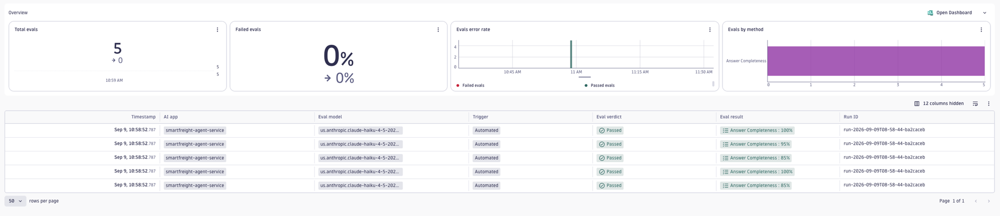

# Agent-session evals

## Why

Some questions can only be answered by the whole conversation. Did the agent
resolve every part of the request? Did it recover after a tool failed three
turns ago? Score each span on its own and the answer is invisible — each step
looks fine in isolation, and the judge never sees the turn where the request was
actually dropped.

`scope.level: agent-session` groups a multi-step conversation into one unit and
runs a single judge call over the full transcript. You get one verdict per
conversation instead of one per span — the level at which completion, recovery,
and coherence actually live.

## How grouping works

- Spans are grouped by `gen_ai.conversation.id`, falling back to `trace.id` when
  the conversation id is absent.
- One representative span per conversation is evaluated — preferring a `stop`
  finish reason, then the latest — with the grouped transcript as its context.
- `keepPartTypes` chooses which message parts enter that transcript (here `text`
  and `tool_call`); `maxMessages` caps its length, oldest dropped first;
  `maxConversations` caps how many conversations are considered before sampling.

Any evaluator can run at this level. This example uses the built-in
`answer-completeness` judge, which reads `input` + `output` and asks whether
every part of the user's request was resolved — a natural whole-conversation
question.

## Install and run

```bash
dt-evals run --config dt-eval-cli/examples/agent-session/agent-session.dt-eval.yaml
```

## Viewing results

Every run prints a summary and a `Run ID`:

```text
Using config: agent-session.dt-eval.yaml
✓ Fetched 5 spans in 693ms
✓ Evaluated 5 tasks in 7.1s
✓ Wrote 5 results in 585ms

Evaluation results:
┌─────────────────────┬───────────────────┬──────────────┐
│ Evaluator           │ Results           │ Avg Duration │
├─────────────────────┼───────────────────┼──────────────┤
│ answer-completeness │ 5/5 (100% passed) │ 3.5s         │
└─────────────────────┴───────────────────┴──────────────┘

Run run-2026-09-09T08-58-44-ba2caceb complete in 8.4s
5 evaluation results written to Dynatrace
```

Five spans fetched, five conversations judged — one result per conversation, not
per span. To inspect individual verdicts, open the **AI Observability** app →
**Evaluations** → **Evals**, then filter by the `Run ID`:

```text
apps/dynatrace.genai.observability/evaluations/evals  →  filter "Run ID" = <run-id>
```



Each row is one conversation — five conversations, five results — and the tiles
summarise the run. Past runs can also be listed or re-inspected from the
terminal:

```bash
dt-evals runs list
dt-evals runs show <run-id>
```

## Customise before running

- Set `scope.service` to your agent's service and `scope.filters` to whatever
  identifies the conversation owner. If sub-agents share the service, filter to
  the orchestrator (commonly `gen_ai.agent.name`) so each session is anchored on
  one owner.
- Swap `answer-completeness` for any evaluator whose question is conversational —
  a built-in judge, a custom judge, or your own. The level is independent of the
  evaluator.
- Raise `maxMessages` if your conversations are long and the judge needs earlier
  turns; raise `maxConversations` to widen the run.

## Limitations

- Without `gen_ai.conversation.id`, grouping falls back to `trace.id` and picks
  one representative span per conversation — preferring a `stop` finish reason,
  then the latest. It does not pick the span with the most complete history.
- `keepPartTypes` and `maxMessages` apply to the full-history extraction, which
  only runs when the input attribute is exactly `gen_ai.input.messages`. If you
  remap it under `scope.spanFields`, they stop applying.
- One representative span is judged per conversation. This is a session-level
  verdict, not a per-turn one; use `agent-span` level when you need to score
  each step.
