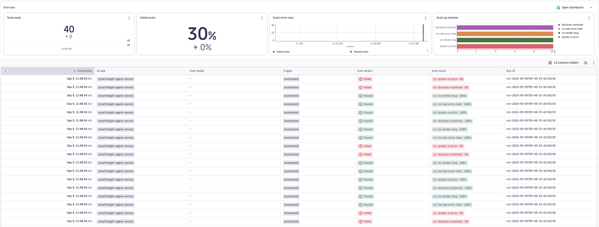

# Code evals

## Why

Not every check needs an LLM. Whether an answer quotes a price, discloses that
it is an estimate, never refuses, or never leaks a stack trace are all decided
by rules, not judgement. A code eval runs that rule in-process as a pure
function: no judge call, no provider credentials, no per-run cost, and the same
input always scores the same way. Use them for policy and format gates you want
to enforce on every run, and save the LLM judge for the questions that actually
need one.

Each check scores the span output as pass (`1.0`) or fail (`0.0`). Add a
`method` to a metric entry to turn it into a code eval; omit `method` and the
entry stays an LLM-as-judge evaluator, so the two mix freely in one config.

## What each check does

| `method` | Passes when the output… | Example use |
|---|---|---|
| `regex` | matches the pattern | quotes a currency amount |
| `must_contain` | contains an expected keyword | discloses it is an estimate |
| `must_not_contain` | contains none of the forbidden keywords | never leaks a templating bug (`undefined`, …) |
| `must_not_match` | does not match the pattern | never leaks a stack trace |
| `json_schema` | parses as JSON valid against the schema | answers with a well-formed object |

`json_schema` needs the optional `ajv` dependency; `regex` and `must_not_match`
need `recheck` (for ReDoS safety). Both are validated up front — a pattern the
guard cannot prove safe is rejected before the run starts, so keep patterns
simple.

## Install and run

No evaluator has to be registered — the methods are built in. Point the config
at your service and run:

```bash
dt-evals run --config dt-eval-cli/examples/code-evals/code-evals.dt-eval.yaml
```

## Viewing results

Every run prints a per-check summary and a `Run ID`:

```text
Using config: code-evals.dt-eval.yaml
✓ Fetched 138 spans in 827ms
✓ Evaluated 40 tasks in 186ms
✓ Wrote 40 results in 810ms

Evaluation results:
┌────────────────────┬─────────────────────┬──────────────┐
│ Evaluator          │ Results             │ Avg Duration │
├────────────────────┼─────────────────────┼──────────────┤
│ quotes-a-price     │ 4/10 (40% passed)   │ 40ms         │
│ discloses-estimate │ 4/10 (40% passed)   │ 0ms          │
│ no-render-bug      │ 10/10 (100% passed) │ 0ms          │
│ no-raw-error-leak  │ 10/10 (100% passed) │ 52ms         │
└────────────────────┴─────────────────────┴──────────────┘

Run run-2026-09-09T09-48-33-afc58258 complete in 1.8s
40 evaluation results written to Dynatrace
```

Each run writes one bizevent per check per span. Code-eval results carry
`gen_ai.evaluation.method` (the method name) and `gen_ai.evaluation.type: custom`,
and land in the same grid as judge results — open the **AI Observability** app →
**Evaluations** → **Evals**, then filter by the `Run ID`:

```text
apps/dynatrace.genai.observability/evaluations/evals  →  filter "Run ID" = <run-id>
```



Here 30% of the checks fail: `quotes-a-price` and `discloses-estimate` fail on
the answers that were not cost quotes (a weather-only or error reply has no price
and no estimate to disclose), while `no-render-bug` and `no-raw-error-leak` pass
across the board. That is the code eval doing its job — the two cost gates only
hold on cost answers, so a failing row points you straight at the span to read.

Past runs can be listed or re-inspected from the terminal:

```bash
dt-evals runs list
dt-evals runs show <run-id>
```

## Customise before running

- Replace the checks with your own policy and format gates. The keywords and
  patterns in this config are placeholders modelled on a shipping-quote agent.
- `scope.filters` keeps only the spans worth checking. This example filters to
  `gen_ai.response.finish_reasons: [stop]` — the agent's final answers — so
  intermediate tool-call spans are not scored.
- Matching is case-insensitive by default; set `caseSensitive: true` on a
  `must_contain` / `must_not_contain` entry to change that.

## Limitations

- Code evals score the span `output` only. For checks that need the request,
  the retrieved context, or a comparison across turns, use an LLM-judge
  evaluator or the `agent-session` example.
- `json_schema` parses the raw output, so the output must be **bare** JSON — a
  response wrapped in markdown fences (` ```json … ``` `) will not parse.
- Scoring is always binary (pass/fail). There is no partial credit; a check
  either holds or it does not.
