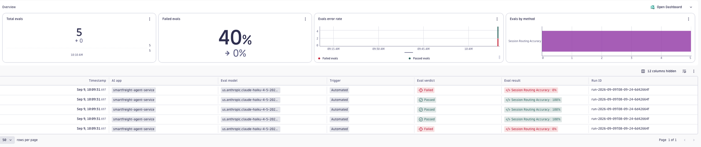

# Routing accuracy

## Why

In a multi-agent system, a wrong handover is a failure the answer can hide: the
orchestrator sends a costs question to the security agent, and you still get a
fluent reply. These examples score the handovers themselves — did each request
reach the agent that owns it — independently of how good any specialist's answer
was. No labelled dataset is needed: an LLM judge compares the delegated work
against the agent roster you define in the evaluator prompt.

Frameworks that implement handoffs record each routing decision as a tool call
on the orchestrator's own LLM span: `handoff_to_pricing`,
`transfer_to_weather_risk`, and so on. Both examples here read those tool calls.
Neither needs a `scope.spanFields` mapping, and neither needs an operation-name
override — the orchestrator's LLM span is usually `chat`, which the default
filter already keeps.

## Which one to use

| | `routing-accuracy` | `session-routing-accuracy` |
|---|---|---|
| Level | `agent-span` | `agent-session` |
| Unit judged | one routing decision | one whole conversation |
| Answers | was this handoff sent to the right agent? | were all the required agents used, in a sensible order? |
| Best for | single-shot routers: one query, one agent | multi-step planners: one query fanned out across several handoffs |

Start with `routing-accuracy` if your orchestrator picks one agent per request.
It gives per-decision attribution and one judge call per decision.

Use `session-routing-accuracy` if your orchestrator plans across several
handoffs. Per-decision scoring cannot answer coverage questions: when a query
needs three agents and they are delegated across three separate steps, each step
looks incomplete on its own, and the judge will report misroutes that are not
real. The session variant sees every handoff at once, so it can also catch
ordering mistakes — a pricing agent invoked before the route data it depends on,
for example.

## Install and run

```bash
dt-evals evaluators add --from-file dt-eval-cli/examples/routing-accuracy/routing-accuracy.evaluator.json
dt-evals run --config dt-eval-cli/examples/routing-accuracy/routing-accuracy.dt-eval.yaml
```

Swap `routing-accuracy` for `session-routing-accuracy` to run the session-level
variant.

## Viewing results

Every run prints a summary and a `Run ID`:

```text
Using config: session-routing-accuracy.dt-eval.yaml
✓ Fetched 5 spans in 732ms
✓ Evaluated 5 tasks in 6.1s
✓ Wrote 5 results in 601ms

Evaluation results:
┌──────────────────────────┬───────────────────┬──────────────┐
│ Evaluator                │ Results           │ Avg Duration │
├──────────────────────────┼───────────────────┼──────────────┤
│ session-routing-accuracy │ 3/5 (60% passed)  │ 3.2s         │
└──────────────────────────┴───────────────────┴──────────────┘

Run run-2026-09-09T08-09-24-6d42664f complete in 7.4s
5 evaluation results written to Dynatrace
```

Each run writes one bizevent per evaluated unit. To inspect individual verdicts,
open the **AI Observability** app → **Evaluations** → **Evals**, then filter the
grid by that `Run ID`:

```text
apps/dynatrace.genai.observability/evaluations/evals  →  filter "Run ID" = <run-id>
```



Each row is one conversation; `Eval result` shows its routing score, and the
tiles summarise pass rate across the run. The same summary is printed in the CLI,
and past runs can be listed or re-inspected without leaving the terminal:

```bash
dt-evals runs list
dt-evals runs show <run-id>
```

## Customise before running

- The `AGENTS` list in the evaluator prompt is a placeholder. Replace it with
  your own roster and the work each agent owns. This is the routing policy — the
  judge has no other source of truth.
- In the config, set `scope.service` to the orchestrator's service and
  `scope.filters` to whatever attribute identifies the orchestrator itself
  (commonly `gen_ai.agent.name`).

> **Note — check how your framework records handoffs.** These examples assume an
> LLM orchestrator that routes by emitting a tool call, so
> `gen_ai.response.finish_reasons: [tool_call]` isolates the routing spans. If a
> non-LLM classifier or explicit code picks the agent (no tool call), or the
> framework records handoffs on a dedicated `invoke_agent` span, that filter
> won't match. First identify which span carries the routing decision, then
> point `scope.filters` at it. To see your own distribution:
>
> ```dql
> fetch spans
> | filter isNotNull(gen_ai.provider.name)
> | summarize count(), by:{gen_ai.operation.name, gen_ai.response.finish_reasons}
> ```

## Limitations

- Assumes OTel GenAI semantic-convention attributes. If your spans use different
  names, map them under `scope.spanFields` — but note that the full-history
  extraction `session-routing-accuracy` depends on only runs when the input
  attribute is exactly `gen_ai.input.messages`, so `keepPartTypes` and
  `maxMessages` stop applying once you remap it.
- Requires handoffs to be recorded as tool calls on the orchestrator's own span.
  If your framework instead exposes the selected agent as a span attribute,
  filter to the routing span and score that attribute directly.
- `gen_ai.agent.name` identifies the agent a span *belongs to*, not the agent
  that was selected. It identifies the orchestrator; it cannot tell you where a
  request was routed.
- Dedicated `invoke_agent` spans often carry no `gen_ai.input.messages` or
  `gen_ai.output.messages`. Spans missing either are dropped, so they are not
  evaluable even though they name the selected agent.
- Without `gen_ai.conversation.id`, `session-routing-accuracy` groups
  conversations by `trace.id`, and picks one representative span per
  conversation — preferring a `stop` finish reason, then the latest. It does not
  pick the span with the most complete history.
