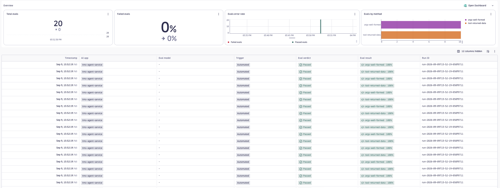
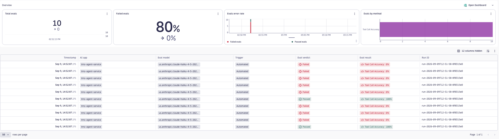

# Tool-call accuracy

## Why

A tool call can go wrong in three different ways, and they are not caught by the
same kind of check:

1. **Malformed** — a required argument is missing, blank, or the wrong type
   (a templating bug emits `origin: ""`). A rule catches this.
2. **Failed** — the call is well-formed but the tool itself errored or came
   back empty (a crash, a timeout, a blank body). A rule catches this from the
   result text. This is *not* the same as a tool correctly reporting no data
   (`No routes found`): that is a valid answer, not a failure, so the rule
   deliberately does not flag it.
3. **Wrong** — the call is well-formed and returns data, but it is the wrong
   tool for the request, or the arguments do not match what was asked (the user
   said Chicago→Miami and the agent searched Chicago→Dallas). Only judgement
   catches this.

The first two are deterministic and free; the third needs an LLM. This example
ships both, so you can gate the cheap failures on every run and reserve the
judge for the one that actually needs reasoning.

## Which check to use

| | `tool-call-validation` | `tool-call-accuracy` |
|---|---|---|
| Kind | deterministic, no LLM | LLM judge |
| Span read | `execute_tool` — the tool call itself | the agent's LLM span — the decision to call it |
| Answers | are the arguments well-formed? did the tool return data? | was the right tool chosen, with values faithful to the request? |
| LLM cost | none | one call per step |
| Catches | malformed args, or a tool that errored / returned empty | wrong tool, wrong or fabricated arguments |

Run `tool-call-validation` on every build as a guardrail. Add `tool-call-accuracy`
when you need to know the arguments are *correct*, not just *present*.

## The deterministic checks (`tool-call-validation`)

The tool call and its arguments live on a dedicated span — the one your
framework emits when it actually invokes the tool, with
`gen_ai.operation.name: execute_tool`. That span carries the structured data on
`gen_ai.tool.*` attributes rather than in chat messages, so the config maps the
canonical slots onto them:

```yaml
scope:
  operationNames: [execute_tool]        # opt in — excluded from the default keep-list
  filters:
    gen_ai.tool.name: <tool-name>       # one tool: its argument shape is specific
  spanFields:
    input: gen_ai.tool.name             # both input and output must resolve, or
    output: gen_ai.tool.call.arguments  # the span is dropped — so map input too
    context: gen_ai.tool.call.result
```

Two checks then run over that data:

| Check | `method` | Reads | Fails when |
|---|---|---|---|
| `args-well-formed` | `json_schema` | the arguments JSON (`output`) | a required field is missing, blank, or the wrong type |
| `tool-returned-data` | `must_not_match` | the result text (`context`) | the result is empty or carries an error / exception signal |

`tool-returned-data` reads the result rather than the arguments, so it routes
`context` into its output slot with a per-metric `inputs:` map. There is no
structured success or error field on the span — a genuine failure only shows as
text — so the pattern matches an empty result (`^\s*$`) plus the fault wording
your tools emit on a crash (`error`, `exception`, `timed out`). Match only
*failures*: do not list business "no data" phrases like `No routes found`, or a
graceful degradation like `… unavailable, using fallback prices` — the tool
answered correctly in both cases, and flagging them punishes it for working.
Adjust the fault list to your stack.

## The judge (`tool-call-accuracy`)

Well-formed is not the same as correct. This evaluator reads the task delegated
to the agent (`input`) and the tool call it chose (`output`, carrying the tool
name and arguments), and scores whether the tool fits the task and every
argument value faithfully reflects an entity named in it — catching a call that
targets the wrong route, invents a shipment id, or picks the wrong tool
entirely. It runs on the agent's LLM span (the one with
`finish_reasons: [tool_call]`), which holds both halves; no `spanFields` mapping
is needed.

This is deliberately narrower than the `routing-accuracy` example: that one
judges which *agent* a request was handed to; this one judges the *arguments* of
a leaf tool call once an agent is already working.

## Install and run

```bash
# Deterministic checks — nothing to register, the methods are built in.
dt-evals run --config dt-eval-cli/examples/tool-call-accuracy/tool-call-validation.dt-eval.yaml

# Judge — register the custom evaluator once, then run.
dt-evals evaluators add --from-file dt-eval-cli/examples/tool-call-accuracy/tool-call-accuracy.evaluator.json
dt-evals run --config dt-eval-cli/examples/tool-call-accuracy/tool-call-accuracy.dt-eval.yaml
```

## Viewing results

Every run prints a per-check summary and a `Run ID`:

```text
Using config: tool-call-validation.dt-eval.yaml
✓ Fetched 70 spans in 497ms
✓ Evaluated 20 tasks in 205ms
✓ Wrote 20 results in 463ms

Evaluation results:
┌────────────────────┬─────────────────────┬──────────────┐
│ Evaluator          │ Results             │ Avg Duration │
├────────────────────┼─────────────────────┼──────────────┤
│ args-well-formed   │ 10/10 (100% passed) │ 3ms          │
│ tool-returned-data │ 10/10 (100% passed) │ 99ms         │
└────────────────────┴─────────────────────┴──────────────┘

Run run-2026-09-09T13-52-19-050f9711 complete in 1.2s
20 evaluation results written to Dynatrace
```

Each run writes one bizevent per check per span. Deterministic results carry
`gen_ai.evaluation.method` and `gen_ai.evaluation.type: custom`; judge results
land in the same grid. Open the **AI Observability** app → **Evaluations** →
**Evals**, then filter by the `Run ID`:

```text
apps/dynatrace.genai.observability/evaluations/evals  →  filter "Run ID" = <run-id>
```



Both checks sit at 100% — the healthy baseline. Every `search_routes` call is
well-formed (`args-well-formed`) and every one returned a result without erroring
(`tool-returned-data`); the calls that came back `No routes found` count as
passes, because a tool correctly reporting no matches did its job. Green is what
you want on a build — these are guardrails, and they trip only when a templating
bug empties an argument or the tool actually crashes. That is the deterministic
layer's role: cheap regression gates that stay quiet until something is
structurally wrong, leaving the question of whether the call was *correct* to the
judge below.

The judge run tells the third part of the story:

```text
┌────────────────────┬───────────────────┬──────────────┐
│ Evaluator          │ Results           │ Avg Duration │
├────────────────────┼───────────────────┼──────────────┤
│ tool-call-accuracy │ 2/10 (20% passed) │ 2.1s         │
└────────────────────┴───────────────────┴──────────────┘
```



Most steps score 0: the judge flags calls whose arguments do not match the
delegated task — for example a `list_carriers` call carrying a fabricated
`mode` the request never asked for. Those calls are well-formed and would pass
`args-well-formed`, which is exactly why the judge earns its cost here.

Past runs can be listed or re-inspected from the terminal:

```bash
dt-evals runs list
dt-evals runs show <run-id>
```

## Customise before running

- Set `scope.service` to the service that emits the tool spans, and
  `gen_ai.tool.name` to the tool you want to check. The `json_schema` and the
  `tool-returned-data` pattern are written for one tool — repeat the config per
  tool, or widen the schema, for more.
- If your tool spans name the arguments/result differently, change the
  `spanFields` mapping. The defaults here follow the OTel GenAI convention
  (`gen_ai.tool.call.arguments`, `gen_ai.tool.call.result`).
- The `TOOLS` roster in the evaluator prompt is a placeholder. Replace it with
  your own tools and what each one's arguments mean — the judge has no other
  source of truth.

## Limitations

- The deterministic checks score one span in isolation. "The agent called this
  tool when it should have called another" is a cross-step judgement — use the
  judge, or the `agent-session` level.
- `json_schema` parses the raw arguments attribute, so it must be bare JSON. A
  provider that records arguments as a fenced or double-encoded string will not
  parse.
- `tool-returned-data` infers failure from text, so it is only as reliable as
  the wording your tools use. Match genuine faults only — an empty body or an
  error / exception — never business "no data" phrases (`No routes found`) or
  graceful fallbacks (`… unavailable, using cached prices`), which are correct
  answers a text match would wrongly fail. A tool that fails silently, or with
  fault wording you did not anticipate, still slips through — for result
  *quality*, prefer the judge.
- The check needs a result attribute to read. If a span records no
  `gen_ai.tool.call.result` at all, the `context` slot resolves empty and
  routing falls back to the arguments, so an entirely missing result passes
  rather than fails.
- The judge reads the tool call the agent *made*. It cannot see a tool the agent
  should have called but did not — an omission has no span to score.
